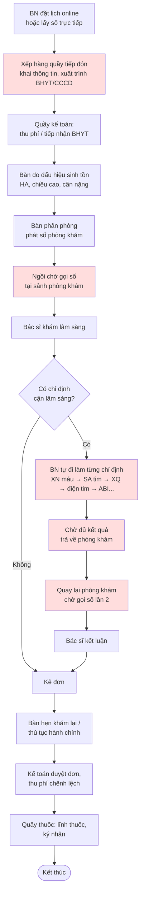
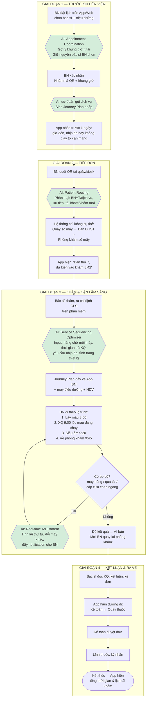
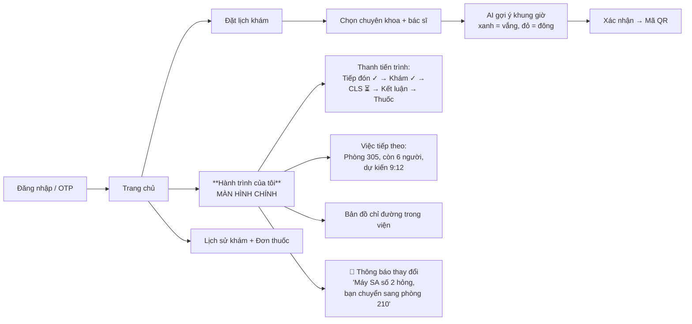
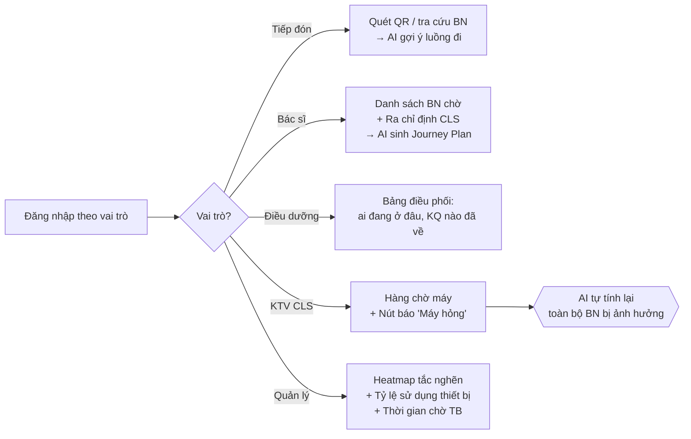
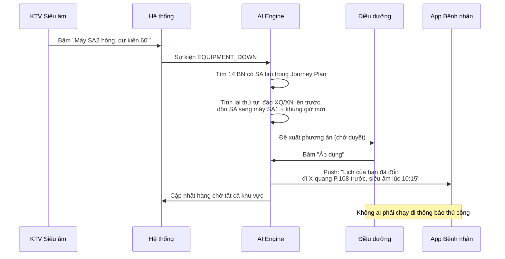

# Quy trình nghiệp vụ — AI Patient Journey Orchestrator

> Tài liệu do **Member 5 (BA2 – UX/UI & QA)** biên soạn.
> Nguồn tham chiếu: QĐ 1313/QĐ-BYT (quy trình khám bệnh tại Khoa Khám bệnh) và QT.25.01 — Quy trình đón tiếp bệnh nhân và khám chữa bệnh ngoại trú tại Khu Tự nguyện 1, CS1, Bệnh viện Tim Hà Nội.
> Toàn bộ sơ đồ viết bằng **Mermaid** — GitHub tự render, không cần Figma.

---

## 1. Nhân vật (Actors)

| Ký hiệu | Vai trò | Dùng giao diện nào |
|---|---|---|
| BN | Bệnh nhân / người nhà | App bệnh nhân + màn hình LED sảnh + SMS |
| TĐ | Nhân viên tiếp đón / tư vấn | Web Dashboard – màn hình Tiếp đón |
| KT | Nhân viên kế toán / thu phí | Web Dashboard – màn hình Thu phí |
| ĐD | Điều dưỡng bàn phân phòng / trả kết quả | Web Dashboard – màn hình Điều phối |
| HDV | Hướng dẫn viên hành lang | App HDV (mobile web) |
| BS | Bác sĩ phòng khám | Web Dashboard – màn hình Phòng khám |
| KTV | Kỹ thuật viên CLS (XN, SA, XQ, CT, MRI) | Web Dashboard – màn hình CLS |
| QL | Quản lý bệnh viện | Web Dashboard – màn hình Giám sát |
| **AI** | AI Coordination Engine | Chạy nền, không có người dùng trực tiếp |

---

## 2. Quy trình HIỆN TẠI (AS-IS) — và các điểm nghẽn



**5 điểm nghẽn (ô màu đỏ) — chính là 5 bài toán đề bài yêu cầu:**

| # | Điểm nghẽn | Hậu quả | Module AI xử lý |
|---|---|---|---|
| 1 | BN dồn vào cùng khung giờ (7h–9h), khung giờ khác trống | Quá tải đầu giờ, phòng khám nhàn buổi chiều | Appointment Coordination |
| 2 | Đi nhầm khu, xếp nhầm hàng, phải quay lại | Mất 15–30 phút/lượt | Patient Routing |
| 3 | Chờ mà không biết bao lâu nữa đến lượt | Lo lắng, không dám rời ghế, không dám đi ăn | Wait-time Estimation |
| 4 | Tự đi làm CLS theo thứ tự ngẫu nhiên | Ví dụ: đi siêu âm trước, XN máu sau → chờ thêm 45' kết quả máu | Service Sequencing |
| 5 | Máy hỏng / bác sĩ bận / cấp cứu chen ngang | Cả lịch trình vỡ, không ai báo BN | Real-time Adjustment |

---

## 3. Quy trình MỚI (TO-BE) — có AI Orchestrator



> **Nguyên tắc bất di bất dịch (ràng buộc cứng):** AI **không** đổi bác sĩ của bệnh nhân. AI chỉ tối ưu những gì *xung quanh* buổi khám: thứ tự dịch vụ, khung giờ, đường đi, thời gian chờ.

---

## 4. Ví dụ minh hoạ — chính là ví dụ trong đề bài

**Bệnh nhân cần: XN máu + Siêu âm + X-quang, rồi quay lại bác sĩ.**

```mermaid
gantt
    title Trước và sau khi có AI (BN vào khám 8:30)
    dateFormat HH:mm
    axisFormat %H:%M

    section Hiện tại (tự đi)
    Chờ siêu âm       :a1, 08:40, 40m
    Siêu âm           :a2, after a1, 15m
    Chờ X-quang       :a3, after a2, 25m
    X-quang           :a4, after a3, 10m
    Chờ lấy máu       :a5, after a4, 20m
    Lấy máu           :a6, after a5, 5m
    Chờ KQ máu        :a7, after a6, 45m
    Chờ gọi số lần 2  :a8, after a7, 20m

    section Có AI (theo Journey Plan)
    Lấy máu ngay      :b1, 08:40, 10m
    X-quang (máu đang chạy) :b2, after b1, 15m
    Siêu âm           :b3, after b2, 25m
    Đệm / KQ về đủ    :b4, after b3, 10m
    Vào gặp bác sĩ    :b5, after b4, 0m
```



Ý tưởng cốt lõi: **việc gì trả kết quả lâu nhất thì làm trước** (XN máu ~45'), rồi chèn các việc ngắn vào lúc chờ. Tiết kiệm ~60–70 phút.

---

## 5. Sơ đồ luồng màn hình (Screen Flow) — thay cho wireframe Figma

### 5.1. App Bệnh nhân



**Mô tả 3 màn hình quan trọng nhất (để Tech Lead code, để BA1 demo):**

**M1 — Chọn khung giờ (Appointment Coordination)**
```
┌──────────────────────────────┐
│  BS. Nguyễn Văn A – Tim mạch │
│  Thứ 3, 12/08               │
├──────────────────────────────┤
│  07:30 🔴 Rất đông (~45' chờ)│
│  08:30 🔴 Đông    (~35' chờ) │
│  09:30 🟡 Vừa     (~15' chờ) │
│  10:30 🟢 Vắng    (~5'  chờ) │  ← AI gợi ý
│  14:00 🟢 Vắng    (~5'  chờ) │
├──────────────────────────────┤
│  💡 Chọn 10:30 để tiết kiệm  │
│     khoảng 40 phút chờ       │
│         [ XÁC NHẬN ]         │
└──────────────────────────────┘
```

**M2 — Hành trình của tôi (Journey Tracker)**
```
┌──────────────────────────────┐
│  Hành trình hôm nay   ⏱ 47'  │
├──────────────────────────────┤
│  ✓ Tiếp đón          08:12   │
│  ✓ Đo sinh hiệu      08:20   │
│  ✓ Khám – BS. A      08:35   │
│  ▶ ĐANG LÀM: Lấy máu         │
│      Tầng 1, quầy 3          │
│  ○ X-quang     ~09:00 P.108  │
│  ○ Siêu âm tim ~09:20 P.210  │
│  ○ Gặp lại BS  ~09:50 P.305  │
├──────────────────────────────┤
│  [ XEM ĐƯỜNG ĐI ]            │
└──────────────────────────────┘
```

**M3 — Màn hình LED sảnh chờ**
```
┌───────────────────────────────────────┐
│  PHÒNG KHÁM 305 – BS. NGUYỄN VĂN A    │
│                                       │
│      ĐANG KHÁM:  3 0 5 – 0 1 2        │
│                                       │
│  Tiếp theo: 013, 014, 015             │
│  Số 020 → dự kiến 09:35               │
└───────────────────────────────────────┘
```

### 5.2. Dashboard nhân viên



**M4 — Bảng điều phối của Điều dưỡng (màn hình "wow" khi demo)**
```
┌──────────────────────────────────────────────────────┐
│  ĐIỀU PHỐI – KHU TỰ NGUYỆN 1        🟢 Bình thường   │
├──────────────────────────────────────────────────────┤
│  Khu vực      | Đang chờ | Chờ TB | Thiết bị        │
│  XN máu       |    8     |  12'   | 🟢 2/2 hoạt động│
│  Siêu âm tim  |   14     |  38'   | 🔴 1/2 (SA2 hỏng)│
│  X-quang      |    3     |   6'   | 🟢 1/1          │
│  Phòng khám305|    6     |  22'   | 🟢              │
├──────────────────────────────────────────────────────┤
│  ⚠️ AI đề xuất: chuyển 5 BN từ SA tim sang khung     │
│     10:30 và làm XQ trước.  [ ÁP DỤNG ] [ BỎ QUA ]   │
└──────────────────────────────────────────────────────┘
```

---

## 6. Luồng xử lý sự cố (Real-time Adjustment) — sequence diagram



---

## 7. Ràng buộc cứng (Hard constraints) — AI KHÔNG được vi phạm

1. Không đổi bác sĩ mà bệnh nhân đã chọn (tính liên tục điều trị).
2. Bệnh nhân ưu tiên (theo QĐ 154 của BVT) luôn được xếp trước.
3. Ca cấp cứu chen ngang tuyệt đối, mọi lịch khác giãn ra.
4. Chỉ định nhịn ăn (XN máu, siêu âm bụng) phải xếp trước các dịch vụ khác trong buổi sáng.
5. Không đảo thứ tự nếu chỉ định có ràng buộc y khoa (ví dụ: siêu âm bụng phải làm khi bàng quang căng).
6. Kết quả CLS phải về đủ mới cho BN vào gặp bác sĩ kết luận.

> Danh sách này Member 2 (Domain Expert) chốt và ghi vào `/data/clinical_rules.json`. Member 5 chỉ mô tả để thiết kế giao diện.

---

## 8. Chỉ số đo (khớp tiêu chí chấm)

| Tiêu chí đề bài | Chỉ số hiển thị trên Dashboard |
|---|---|
| Giảm thời gian chờ trung bình | Thời gian chờ TB / bệnh nhân (phút) |
| Giảm ùn tắc | Số BN chờ cùng lúc theo khu vực (heatmap) |
| Tăng công suất phòng khám & thiết bị | % thời gian máy hoạt động / tổng giờ mở |
| BN chủ động theo dõi | % BN mở App xem Journey ≥ 1 lần |
